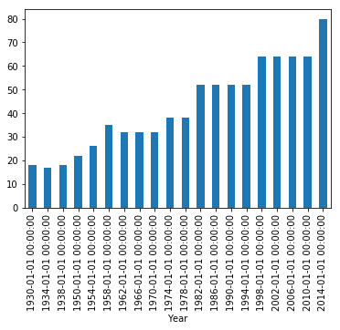
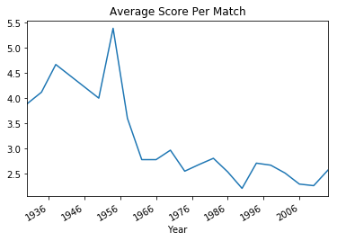
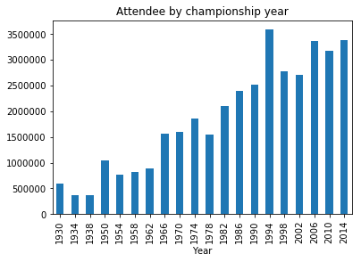
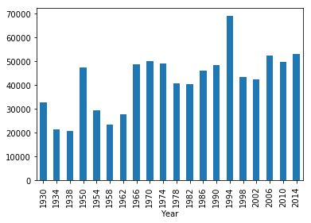
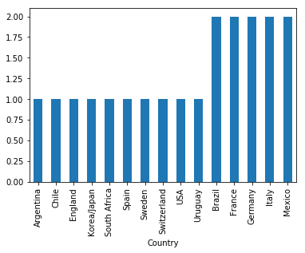
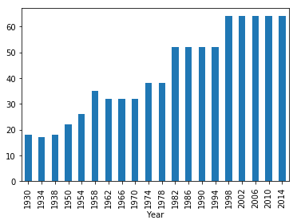
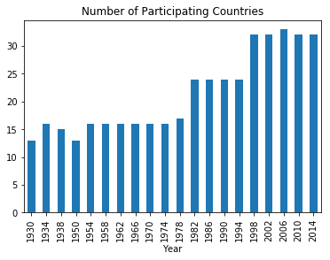
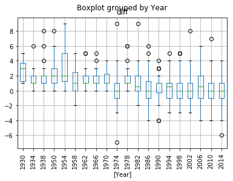

```python
import pandas as pd
import matplotlib.pyplot as plt
import math
import numpy as np
from sklearn import tree
import folium
```


```python
world_cup_matches = pd.read_csv("WorldCupMatches.csv")
world_cup_players = pd.read_csv('WorldCupPlayers.csv')
world_cups = pd.read_csv('WorldCups.csv')
#world_cup_matches.head()
```

## How many world cup championships have happened so far?


```python
print('There are ',world_cups['Year'].count(),'World Cup Championships so far')
```

    There are  20 World Cup Championships so far


## Percentage of home teams that won the finals


```python

world_cup_matches['Datetime'] = pd.to_datetime(world_cup_matches['Datetime'])

world_cup_matches['Datetime'] = world_cup_matches['Datetime'].dt.date
#set(world_cup_matches['Win conditions'])

#world_cup_matches[(df.A == 1) & (df.D == 6)]
world_cup_matches_final = world_cup_matches[(world_cup_matches['Stage']=='Final')]

number_of_matches_home_wins = world_cup_matches_final[(world_cup_matches_final['Home Team Goals']> world_cup_matches_final['Away Team Goals'])].shape[0]
number_of_matches_away_wins = world_cup_matches_final[(world_cup_matches_final['Home Team Goals']< world_cup_matches_final['Away Team Goals'])].shape[0]
print(round(number_of_matches_home_wins/(number_of_matches_away_wins+number_of_matches_home_wins)*100,2),"% of home teams won the finals")


```

    77.78 % of home teams won the finals


* 78% of home teams won the matches

## Number of Matches in a Year


```python

import numpy as np
##  
world_cup_matches_number_of_attendents = world_cup_matches.groupby(['Datetime']).agg({'Attendance':np.sum})
##
print(world_cup_matches_number_of_attendents.columns)


##number of matches played throughout the years

world_cup_matches_year = world_cup_matches.groupby(['Year']).size().reset_index()

world_cup_matches_year['n'] = world_cup_matches_year[0]

#world_cup_matches_year.drop([0])

del world_cup_matches_year[0]


#print(world_cup_matches_year.Year)


world_cup_matches_year['Year'] = world_cup_matches_year.Year.astype(int)

world_cup_matches_year.Year = pd.to_datetime(world_cup_matches_year.Year, format='%Y')

world_cup_matches_year.plot(kind='bar',x='Year',y='n')
plt.legend().remove()
plt.show()


#world_cup_matches_year['Year'] = pd.to_numeric(world_cup_matches_year['Year'], errors='coerce')
#world_cup_matches_year['Year'] = pd.to_datetime(world_cup_matches_year['Year'], format='%Y')

##

#world_cup_matches_year.head()


```

    Index(['Attendance'], dtype='object')





## Number of Cups by each Country


```python
#world_cups.head()
#print(world_cups)

mask = world_cups.Winner == 'Germany FR'
column_name = 'Winner'
world_cups.loc[mask, column_name] = 'Germany'
#print(world_cups)
df = world_cups.groupby('Winner').agg({'Winner': 'count'}).sort_values(by='Winner')
df['countries'] = df.index
df.columns = ['number_of_cups','countries']
df.reset_index(drop = True, inplace = True)

df['lat'] = [-0.116667,2,-4,-64,-56,9,12,-52]
df['lon'] = [51.5,47,40,-34,-33,51,43,-10]
df['number_of_cups']= 10000*(np.exp(df['number_of_cups'].astype('float')))


#print(df)

m = folium.Map(location=[20,0], tiles="Mapbox Bright", zoom_start=2)
 
# I can add marker one by one on the map
for i in range(0,len(df)):
   folium.Circle(
      location=[df.iloc[i]['lon'], df.iloc[i]['lat']],
      popup=df.iloc[i]['countries'],
      radius=df.iloc[i]['number_of_cups'],
      color='crimson',
      fill=True,
      fill_color='crimson'
   ).add_to(m)
m


```


<div style="width:100%;"><div style="position:relative;width:100%;height:0;padding-bottom:60%;"><iframe src="data:text/html;charset=utf-8;base64,PCFET0NUWVBFIGh0bWw+CjxoZWFkPiAgICAKICAgIDxtZXRhIGh0dHAtZXF1aXY9ImNvbnRlbnQtdHlwZSIgY29udGVudD0idGV4dC9odG1sOyBjaGFyc2V0PVVURi04IiAvPgogICAgPHNjcmlwdD5MX1BSRUZFUl9DQU5WQVMgPSBmYWxzZTsgTF9OT19UT1VDSCA9IGZhbHNlOyBMX0RJU0FCTEVfM0QgPSBmYWxzZTs8L3NjcmlwdD4KICAgIDxzY3JpcHQgc3JjPSJodHRwczovL2Nkbi5qc2RlbGl2ci5uZXQvbnBtL2xlYWZsZXRAMS4yLjAvZGlzdC9sZWFmbGV0LmpzIj48L3NjcmlwdD4KICAgIDxzY3JpcHQgc3JjPSJodHRwczovL2FqYXguZ29vZ2xlYXBpcy5jb20vYWpheC9saWJzL2pxdWVyeS8xLjExLjEvanF1ZXJ5Lm1pbi5qcyI+PC9zY3JpcHQ+CiAgICA8c2NyaXB0IHNyYz0iaHR0cHM6Ly9tYXhjZG4uYm9vdHN0cmFwY2RuLmNvbS9ib290c3RyYXAvMy4yLjAvanMvYm9vdHN0cmFwLm1pbi5qcyI+PC9zY3JpcHQ+CiAgICA8c2NyaXB0IHNyYz0iaHR0cHM6Ly9jZG5qcy5jbG91ZGZsYXJlLmNvbS9hamF4L2xpYnMvTGVhZmxldC5hd2Vzb21lLW1hcmtlcnMvMi4wLjIvbGVhZmxldC5hd2Vzb21lLW1hcmtlcnMuanMiPjwvc2NyaXB0PgogICAgPGxpbmsgcmVsPSJzdHlsZXNoZWV0IiBocmVmPSJodHRwczovL2Nkbi5qc2RlbGl2ci5uZXQvbnBtL2xlYWZsZXRAMS4yLjAvZGlzdC9sZWFmbGV0LmNzcyIvPgogICAgPGxpbmsgcmVsPSJzdHlsZXNoZWV0IiBocmVmPSJodHRwczovL21heGNkbi5ib290c3RyYXBjZG4uY29tL2Jvb3RzdHJhcC8zLjIuMC9jc3MvYm9vdHN0cmFwLm1pbi5jc3MiLz4KICAgIDxsaW5rIHJlbD0ic3R5bGVzaGVldCIgaHJlZj0iaHR0cHM6Ly9tYXhjZG4uYm9vdHN0cmFwY2RuLmNvbS9ib290c3RyYXAvMy4yLjAvY3NzL2Jvb3RzdHJhcC10aGVtZS5taW4uY3NzIi8+CiAgICA8bGluayByZWw9InN0eWxlc2hlZXQiIGhyZWY9Imh0dHBzOi8vbWF4Y2RuLmJvb3RzdHJhcGNkbi5jb20vZm9udC1hd2Vzb21lLzQuNi4zL2Nzcy9mb250LWF3ZXNvbWUubWluLmNzcyIvPgogICAgPGxpbmsgcmVsPSJzdHlsZXNoZWV0IiBocmVmPSJodHRwczovL2NkbmpzLmNsb3VkZmxhcmUuY29tL2FqYXgvbGlicy9MZWFmbGV0LmF3ZXNvbWUtbWFya2Vycy8yLjAuMi9sZWFmbGV0LmF3ZXNvbWUtbWFya2Vycy5jc3MiLz4KICAgIDxsaW5rIHJlbD0ic3R5bGVzaGVldCIgaHJlZj0iaHR0cHM6Ly9yYXdnaXQuY29tL3B5dGhvbi12aXN1YWxpemF0aW9uL2ZvbGl1bS9tYXN0ZXIvZm9saXVtL3RlbXBsYXRlcy9sZWFmbGV0LmF3ZXNvbWUucm90YXRlLmNzcyIvPgogICAgPHN0eWxlPmh0bWwsIGJvZHkge3dpZHRoOiAxMDAlO2hlaWdodDogMTAwJTttYXJnaW46IDA7cGFkZGluZzogMDt9PC9zdHlsZT4KICAgIDxzdHlsZT4jbWFwIHtwb3NpdGlvbjphYnNvbHV0ZTt0b3A6MDtib3R0b206MDtyaWdodDowO2xlZnQ6MDt9PC9zdHlsZT4KICAgIAogICAgICAgICAgICA8c3R5bGU+ICNtYXBfMWViZTZkZGFiOTk3NDY4NTlhMGQwZDEwNWY3M2RkMDUgewogICAgICAgICAgICAgICAgcG9zaXRpb24gOiByZWxhdGl2ZTsKICAgICAgICAgICAgICAgIHdpZHRoIDogMTAwLjAlOwogICAgICAgICAgICAgICAgaGVpZ2h0OiAxMDAuMCU7CiAgICAgICAgICAgICAgICBsZWZ0OiAwLjAlOwogICAgICAgICAgICAgICAgdG9wOiAwLjAlOwogICAgICAgICAgICAgICAgfQogICAgICAgICAgICA8L3N0eWxlPgogICAgICAgIAo8L2hlYWQ+Cjxib2R5PiAgICAKICAgIAogICAgICAgICAgICA8ZGl2IGNsYXNzPSJmb2xpdW0tbWFwIiBpZD0ibWFwXzFlYmU2ZGRhYjk5NzQ2ODU5YTBkMGQxMDVmNzNkZDA1IiA+PC9kaXY+CiAgICAgICAgCjwvYm9keT4KPHNjcmlwdD4gICAgCiAgICAKCiAgICAgICAgICAgIAogICAgICAgICAgICAgICAgdmFyIGJvdW5kcyA9IG51bGw7CiAgICAgICAgICAgIAoKICAgICAgICAgICAgdmFyIG1hcF8xZWJlNmRkYWI5OTc0Njg1OWEwZDBkMTA1ZjczZGQwNSA9IEwubWFwKAogICAgICAgICAgICAgICAgICAgICAgICAgICAgICAgICAgJ21hcF8xZWJlNmRkYWI5OTc0Njg1OWEwZDBkMTA1ZjczZGQwNScsCiAgICAgICAgICAgICAgICAgICAgICAgICAgICAgICAgICB7Y2VudGVyOiBbMjAsMF0sCiAgICAgICAgICAgICAgICAgICAgICAgICAgICAgICAgICB6b29tOiAyLAogICAgICAgICAgICAgICAgICAgICAgICAgICAgICAgICAgbWF4Qm91bmRzOiBib3VuZHMsCiAgICAgICAgICAgICAgICAgICAgICAgICAgICAgICAgICBsYXllcnM6IFtdLAogICAgICAgICAgICAgICAgICAgICAgICAgICAgICAgICAgd29ybGRDb3B5SnVtcDogZmFsc2UsCiAgICAgICAgICAgICAgICAgICAgICAgICAgICAgICAgICBjcnM6IEwuQ1JTLkVQU0czODU3CiAgICAgICAgICAgICAgICAgICAgICAgICAgICAgICAgIH0pOwogICAgICAgICAgICAKICAgICAgICAKICAgIAogICAgICAgICAgICB2YXIgdGlsZV9sYXllcl85OTMxMmJjYTQwOTg0OTJmYWVkNjQ2ZTVkYmEyZmQzOSA9IEwudGlsZUxheWVyKAogICAgICAgICAgICAgICAgJ2h0dHBzOi8ve3N9LnRpbGVzLm1hcGJveC5jb20vdjMvbWFwYm94LndvcmxkLWJyaWdodC97en0ve3h9L3t5fS5wbmcnLAogICAgICAgICAgICAgICAgewogICJhdHRyaWJ1dGlvbiI6IG51bGwsCiAgImRldGVjdFJldGluYSI6IGZhbHNlLAogICJtYXhab29tIjogMTgsCiAgIm1pblpvb20iOiAxLAogICJub1dyYXAiOiBmYWxzZSwKICAic3ViZG9tYWlucyI6ICJhYmMiCn0KICAgICAgICAgICAgICAgICkuYWRkVG8obWFwXzFlYmU2ZGRhYjk5NzQ2ODU5YTBkMGQxMDVmNzNkZDA1KTsKICAgICAgICAKICAgIAoKICAgICAgICAgICAgdmFyIGNpcmNsZV9lYzhmMTQ2NmExZmY0YjU2OWE5OTllMzkwMzgzNGI2ZiA9IEwuY2lyY2xlKAogICAgICAgICAgICAgICAgWzUxLjUsLTAuMTE2NjY3XSwKICAgICAgICAgICAgICAgIHsKICAiYnViYmxpbmdNb3VzZUV2ZW50cyI6IHRydWUsCiAgImNvbG9yIjogImNyaW1zb24iLAogICJkYXNoQXJyYXkiOiBudWxsLAogICJkYXNoT2Zmc2V0IjogbnVsbCwKICAiZmlsbCI6IHRydWUsCiAgImZpbGxDb2xvciI6ICJjcmltc29uIiwKICAiZmlsbE9wYWNpdHkiOiAwLjIsCiAgImZpbGxSdWxlIjogImV2ZW5vZGQiLAogICJsaW5lQ2FwIjogInJvdW5kIiwKICAibGluZUpvaW4iOiAicm91bmQiLAogICJvcGFjaXR5IjogMS4wLAogICJyYWRpdXMiOiAyNzE4Mi44MTgyODQ1OTA0NTIsCiAgInN0cm9rZSI6IHRydWUsCiAgIndlaWdodCI6IDMKfQogICAgICAgICAgICAgICAgKS5hZGRUbyhtYXBfMWViZTZkZGFiOTk3NDY4NTlhMGQwZDEwNWY3M2RkMDUpOwogICAgICAgICAgICAKICAgIAogICAgICAgICAgICB2YXIgcG9wdXBfYWJiOTBmY2RjZGIwNGFmYzgyNjU2ZDgzY2Y5YWM2NzIgPSBMLnBvcHVwKHttYXhXaWR0aDogJzMwMCd9KTsKCiAgICAgICAgICAgIAogICAgICAgICAgICAgICAgdmFyIGh0bWxfMmU0YzNiNzAxOTgxNGQyOGExOTIxNWZiODgwZWU0YzQgPSAkKCc8ZGl2IGlkPSJodG1sXzJlNGMzYjcwMTk4MTRkMjhhMTkyMTVmYjg4MGVlNGM0IiBzdHlsZT0id2lkdGg6IDEwMC4wJTsgaGVpZ2h0OiAxMDAuMCU7Ij5FbmdsYW5kPC9kaXY+JylbMF07CiAgICAgICAgICAgICAgICBwb3B1cF9hYmI5MGZjZGNkYjA0YWZjODI2NTZkODNjZjlhYzY3Mi5zZXRDb250ZW50KGh0bWxfMmU0YzNiNzAxOTgxNGQyOGExOTIxNWZiODgwZWU0YzQpOwogICAgICAgICAgICAKCiAgICAgICAgICAgIGNpcmNsZV9lYzhmMTQ2NmExZmY0YjU2OWE5OTllMzkwMzgzNGI2Zi5iaW5kUG9wdXAocG9wdXBfYWJiOTBmY2RjZGIwNGFmYzgyNjU2ZDgzY2Y5YWM2NzIpOwoKICAgICAgICAgICAgCiAgICAgICAgCiAgICAKCiAgICAgICAgICAgIHZhciBjaXJjbGVfNzliYjQzMTUwNDFlNDk3ZDlkM2E3YmVmZmMxMWY0MjYgPSBMLmNpcmNsZSgKICAgICAgICAgICAgICAgIFs0Ny4wLDIuMF0sCiAgICAgICAgICAgICAgICB7CiAgImJ1YmJsaW5nTW91c2VFdmVudHMiOiB0cnVlLAogICJjb2xvciI6ICJjcmltc29uIiwKICAiZGFzaEFycmF5IjogbnVsbCwKICAiZGFzaE9mZnNldCI6IG51bGwsCiAgImZpbGwiOiB0cnVlLAogICJmaWxsQ29sb3IiOiAiY3JpbXNvbiIsCiAgImZpbGxPcGFjaXR5IjogMC4yLAogICJmaWxsUnVsZSI6ICJldmVub2RkIiwKICAibGluZUNhcCI6ICJyb3VuZCIsCiAgImxpbmVKb2luIjogInJvdW5kIiwKICAib3BhY2l0eSI6IDEuMCwKICAicmFkaXVzIjogMjcxODIuODE4Mjg0NTkwNDUyLAogICJzdHJva2UiOiB0cnVlLAogICJ3ZWlnaHQiOiAzCn0KICAgICAgICAgICAgICAgICkuYWRkVG8obWFwXzFlYmU2ZGRhYjk5NzQ2ODU5YTBkMGQxMDVmNzNkZDA1KTsKICAgICAgICAgICAgCiAgICAKICAgICAgICAgICAgdmFyIHBvcHVwX2IyZGVjNDlhYjUxNjQyNjg5YzQwODZjMmM3YTkyNWRjID0gTC5wb3B1cCh7bWF4V2lkdGg6ICczMDAnfSk7CgogICAgICAgICAgICAKICAgICAgICAgICAgICAgIHZhciBodG1sXzhmMTliOGJhNTEwODRmNGU5YmNlZjY4ZWViMTE4MmQ1ID0gJCgnPGRpdiBpZD0iaHRtbF84ZjE5YjhiYTUxMDg0ZjRlOWJjZWY2OGVlYjExODJkNSIgc3R5bGU9IndpZHRoOiAxMDAuMCU7IGhlaWdodDogMTAwLjAlOyI+RnJhbmNlPC9kaXY+JylbMF07CiAgICAgICAgICAgICAgICBwb3B1cF9iMmRlYzQ5YWI1MTY0MjY4OWM0MDg2YzJjN2E5MjVkYy5zZXRDb250ZW50KGh0bWxfOGYxOWI4YmE1MTA4NGY0ZTliY2VmNjhlZWIxMTgyZDUpOwogICAgICAgICAgICAKCiAgICAgICAgICAgIGNpcmNsZV83OWJiNDMxNTA0MWU0OTdkOWQzYTdiZWZmYzExZjQyNi5iaW5kUG9wdXAocG9wdXBfYjJkZWM0OWFiNTE2NDI2ODljNDA4NmMyYzdhOTI1ZGMpOwoKICAgICAgICAgICAgCiAgICAgICAgCiAgICAKCiAgICAgICAgICAgIHZhciBjaXJjbGVfMTliZTQzNzQ5ZDBkNDUyYzgwYTgwOGQ2MjE0MmRhMGUgPSBMLmNpcmNsZSgKICAgICAgICAgICAgICAgIFs0MC4wLC00LjBdLAogICAgICAgICAgICAgICAgewogICJidWJibGluZ01vdXNlRXZlbnRzIjogdHJ1ZSwKICAiY29sb3IiOiAiY3JpbXNvbiIsCiAgImRhc2hBcnJheSI6IG51bGwsCiAgImRhc2hPZmZzZXQiOiBudWxsLAogICJmaWxsIjogdHJ1ZSwKICAiZmlsbENvbG9yIjogImNyaW1zb24iLAogICJmaWxsT3BhY2l0eSI6IDAuMiwKICAiZmlsbFJ1bGUiOiAiZXZlbm9kZCIsCiAgImxpbmVDYXAiOiAicm91bmQiLAogICJsaW5lSm9pbiI6ICJyb3VuZCIsCiAgIm9wYWNpdHkiOiAxLjAsCiAgInJhZGl1cyI6IDI3MTgyLjgxODI4NDU5MDQ1MiwKICAic3Ryb2tlIjogdHJ1ZSwKICAid2VpZ2h0IjogMwp9CiAgICAgICAgICAgICAgICApLmFkZFRvKG1hcF8xZWJlNmRkYWI5OTc0Njg1OWEwZDBkMTA1ZjczZGQwNSk7CiAgICAgICAgICAgIAogICAgCiAgICAgICAgICAgIHZhciBwb3B1cF8zNWM0OWJiYWI1MTA0ZTliOWI4NTkyM2QzN2FjYjg3YiA9IEwucG9wdXAoe21heFdpZHRoOiAnMzAwJ30pOwoKICAgICAgICAgICAgCiAgICAgICAgICAgICAgICB2YXIgaHRtbF9jM2NiZjlkNDBhNWM0ZWE0YjcyN2M2MGE1OTM3ZWEyZCA9ICQoJzxkaXYgaWQ9Imh0bWxfYzNjYmY5ZDQwYTVjNGVhNGI3MjdjNjBhNTkzN2VhMmQiIHN0eWxlPSJ3aWR0aDogMTAwLjAlOyBoZWlnaHQ6IDEwMC4wJTsiPlNwYWluPC9kaXY+JylbMF07CiAgICAgICAgICAgICAgICBwb3B1cF8zNWM0OWJiYWI1MTA0ZTliOWI4NTkyM2QzN2FjYjg3Yi5zZXRDb250ZW50KGh0bWxfYzNjYmY5ZDQwYTVjNGVhNGI3MjdjNjBhNTkzN2VhMmQpOwogICAgICAgICAgICAKCiAgICAgICAgICAgIGNpcmNsZV8xOWJlNDM3NDlkMGQ0NTJjODBhODA4ZDYyMTQyZGEwZS5iaW5kUG9wdXAocG9wdXBfMzVjNDliYmFiNTEwNGU5YjliODU5MjNkMzdhY2I4N2IpOwoKICAgICAgICAgICAgCiAgICAgICAgCiAgICAKCiAgICAgICAgICAgIHZhciBjaXJjbGVfMjU0MTliYTRiZTZlNDg5NTk5NjgzMzdmMmZhNmZmZDQgPSBMLmNpcmNsZSgKICAgICAgICAgICAgICAgIFstMzQuMCwtNjQuMF0sCiAgICAgICAgICAgICAgICB7CiAgImJ1YmJsaW5nTW91c2VFdmVudHMiOiB0cnVlLAogICJjb2xvciI6ICJjcmltc29uIiwKICAiZGFzaEFycmF5IjogbnVsbCwKICAiZGFzaE9mZnNldCI6IG51bGwsCiAgImZpbGwiOiB0cnVlLAogICJmaWxsQ29sb3IiOiAiY3JpbXNvbiIsCiAgImZpbGxPcGFjaXR5IjogMC4yLAogICJmaWxsUnVsZSI6ICJldmVub2RkIiwKICAibGluZUNhcCI6ICJyb3VuZCIsCiAgImxpbmVKb2luIjogInJvdW5kIiwKICAib3BhY2l0eSI6IDEuMCwKICAicmFkaXVzIjogNzM4OTAuNTYwOTg5MzA2NSwKICAic3Ryb2tlIjogdHJ1ZSwKICAid2VpZ2h0IjogMwp9CiAgICAgICAgICAgICAgICApLmFkZFRvKG1hcF8xZWJlNmRkYWI5OTc0Njg1OWEwZDBkMTA1ZjczZGQwNSk7CiAgICAgICAgICAgIAogICAgCiAgICAgICAgICAgIHZhciBwb3B1cF9iMTZhNzMyMDY3MzE0YjM5YTBhOGZlYzhjMDI0OTM3MSA9IEwucG9wdXAoe21heFdpZHRoOiAnMzAwJ30pOwoKICAgICAgICAgICAgCiAgICAgICAgICAgICAgICB2YXIgaHRtbF8yMzhkOWIzZmM0ZGY0NzIxYmNiNDA3ODQ4MGM1NmQxMCA9ICQoJzxkaXYgaWQ9Imh0bWxfMjM4ZDliM2ZjNGRmNDcyMWJjYjQwNzg0ODBjNTZkMTAiIHN0eWxlPSJ3aWR0aDogMTAwLjAlOyBoZWlnaHQ6IDEwMC4wJTsiPkFyZ2VudGluYTwvZGl2PicpWzBdOwogICAgICAgICAgICAgICAgcG9wdXBfYjE2YTczMjA2NzMxNGIzOWEwYThmZWM4YzAyNDkzNzEuc2V0Q29udGVudChodG1sXzIzOGQ5YjNmYzRkZjQ3MjFiY2I0MDc4NDgwYzU2ZDEwKTsKICAgICAgICAgICAgCgogICAgICAgICAgICBjaXJjbGVfMjU0MTliYTRiZTZlNDg5NTk5NjgzMzdmMmZhNmZmZDQuYmluZFBvcHVwKHBvcHVwX2IxNmE3MzIwNjczMTRiMzlhMGE4ZmVjOGMwMjQ5MzcxKTsKCiAgICAgICAgICAgIAogICAgICAgIAogICAgCgogICAgICAgICAgICB2YXIgY2lyY2xlXzczY2JmMDViYjc2ZTQxZjk5ZTY5NmQ1MDgxZGQ5YTcyID0gTC5jaXJjbGUoCiAgICAgICAgICAgICAgICBbLTMzLjAsLTU2LjBdLAogICAgICAgICAgICAgICAgewogICJidWJibGluZ01vdXNlRXZlbnRzIjogdHJ1ZSwKICAiY29sb3IiOiAiY3JpbXNvbiIsCiAgImRhc2hBcnJheSI6IG51bGwsCiAgImRhc2hPZmZzZXQiOiBudWxsLAogICJmaWxsIjogdHJ1ZSwKICAiZmlsbENvbG9yIjogImNyaW1zb24iLAogICJmaWxsT3BhY2l0eSI6IDAuMiwKICAiZmlsbFJ1bGUiOiAiZXZlbm9kZCIsCiAgImxpbmVDYXAiOiAicm91bmQiLAogICJsaW5lSm9pbiI6ICJyb3VuZCIsCiAgIm9wYWNpdHkiOiAxLjAsCiAgInJhZGl1cyI6IDczODkwLjU2MDk4OTMwNjUsCiAgInN0cm9rZSI6IHRydWUsCiAgIndlaWdodCI6IDMKfQogICAgICAgICAgICAgICAgKS5hZGRUbyhtYXBfMWViZTZkZGFiOTk3NDY4NTlhMGQwZDEwNWY3M2RkMDUpOwogICAgICAgICAgICAKICAgIAogICAgICAgICAgICB2YXIgcG9wdXBfOTBiZjhmYmE3MWY0NDFmYzg5NGUwNDFkNWI4OGZlMDUgPSBMLnBvcHVwKHttYXhXaWR0aDogJzMwMCd9KTsKCiAgICAgICAgICAgIAogICAgICAgICAgICAgICAgdmFyIGh0bWxfYThiZTZiYTFkOWUzNGRjMTkzNzA4NTgxYTMzYzhkMzEgPSAkKCc8ZGl2IGlkPSJodG1sX2E4YmU2YmExZDllMzRkYzE5MzcwODU4MWEzM2M4ZDMxIiBzdHlsZT0id2lkdGg6IDEwMC4wJTsgaGVpZ2h0OiAxMDAuMCU7Ij5VcnVndWF5PC9kaXY+JylbMF07CiAgICAgICAgICAgICAgICBwb3B1cF85MGJmOGZiYTcxZjQ0MWZjODk0ZTA0MWQ1Yjg4ZmUwNS5zZXRDb250ZW50KGh0bWxfYThiZTZiYTFkOWUzNGRjMTkzNzA4NTgxYTMzYzhkMzEpOwogICAgICAgICAgICAKCiAgICAgICAgICAgIGNpcmNsZV83M2NiZjA1YmI3NmU0MWY5OWU2OTZkNTA4MWRkOWE3Mi5iaW5kUG9wdXAocG9wdXBfOTBiZjhmYmE3MWY0NDFmYzg5NGUwNDFkNWI4OGZlMDUpOwoKICAgICAgICAgICAgCiAgICAgICAgCiAgICAKCiAgICAgICAgICAgIHZhciBjaXJjbGVfNGJhMDEyMWU4NjcwNDljNWIyMjI2YWIxMDAyNzc2ZDkgPSBMLmNpcmNsZSgKICAgICAgICAgICAgICAgIFs1MS4wLDkuMF0sCiAgICAgICAgICAgICAgICB7CiAgImJ1YmJsaW5nTW91c2VFdmVudHMiOiB0cnVlLAogICJjb2xvciI6ICJjcmltc29uIiwKICAiZGFzaEFycmF5IjogbnVsbCwKICAiZGFzaE9mZnNldCI6IG51bGwsCiAgImZpbGwiOiB0cnVlLAogICJmaWxsQ29sb3IiOiAiY3JpbXNvbiIsCiAgImZpbGxPcGFjaXR5IjogMC4yLAogICJmaWxsUnVsZSI6ICJldmVub2RkIiwKICAibGluZUNhcCI6ICJyb3VuZCIsCiAgImxpbmVKb2luIjogInJvdW5kIiwKICAib3BhY2l0eSI6IDEuMCwKICAicmFkaXVzIjogNTQ1OTgxLjUwMDMzMTQ0MjMsCiAgInN0cm9rZSI6IHRydWUsCiAgIndlaWdodCI6IDMKfQogICAgICAgICAgICAgICAgKS5hZGRUbyhtYXBfMWViZTZkZGFiOTk3NDY4NTlhMGQwZDEwNWY3M2RkMDUpOwogICAgICAgICAgICAKICAgIAogICAgICAgICAgICB2YXIgcG9wdXBfZGQ4MzgwZDkxY2E5NDhmMjkyYTZlYWI0ZDZmYmM3MDEgPSBMLnBvcHVwKHttYXhXaWR0aDogJzMwMCd9KTsKCiAgICAgICAgICAgIAogICAgICAgICAgICAgICAgdmFyIGh0bWxfZDdlZGFkYmZhOWY0NGY0ZWE1ZDQ2Nzg0ZjBkNDlkMGMgPSAkKCc8ZGl2IGlkPSJodG1sX2Q3ZWRhZGJmYTlmNDRmNGVhNWQ0Njc4NGYwZDQ5ZDBjIiBzdHlsZT0id2lkdGg6IDEwMC4wJTsgaGVpZ2h0OiAxMDAuMCU7Ij5HZXJtYW55PC9kaXY+JylbMF07CiAgICAgICAgICAgICAgICBwb3B1cF9kZDgzODBkOTFjYTk0OGYyOTJhNmVhYjRkNmZiYzcwMS5zZXRDb250ZW50KGh0bWxfZDdlZGFkYmZhOWY0NGY0ZWE1ZDQ2Nzg0ZjBkNDlkMGMpOwogICAgICAgICAgICAKCiAgICAgICAgICAgIGNpcmNsZV80YmEwMTIxZTg2NzA0OWM1YjIyMjZhYjEwMDI3NzZkOS5iaW5kUG9wdXAocG9wdXBfZGQ4MzgwZDkxY2E5NDhmMjkyYTZlYWI0ZDZmYmM3MDEpOwoKICAgICAgICAgICAgCiAgICAgICAgCiAgICAKCiAgICAgICAgICAgIHZhciBjaXJjbGVfNDNiMjVlOTVhYjUyNDRiZDgyNDA0ZjZjNmIwYTdmZTEgPSBMLmNpcmNsZSgKICAgICAgICAgICAgICAgIFs0My4wLDEyLjBdLAogICAgICAgICAgICAgICAgewogICJidWJibGluZ01vdXNlRXZlbnRzIjogdHJ1ZSwKICAiY29sb3IiOiAiY3JpbXNvbiIsCiAgImRhc2hBcnJheSI6IG51bGwsCiAgImRhc2hPZmZzZXQiOiBudWxsLAogICJmaWxsIjogdHJ1ZSwKICAiZmlsbENvbG9yIjogImNyaW1zb24iLAogICJmaWxsT3BhY2l0eSI6IDAuMiwKICAiZmlsbFJ1bGUiOiAiZXZlbm9kZCIsCiAgImxpbmVDYXAiOiAicm91bmQiLAogICJsaW5lSm9pbiI6ICJyb3VuZCIsCiAgIm9wYWNpdHkiOiAxLjAsCiAgInJhZGl1cyI6IDU0NTk4MS41MDAzMzE0NDIzLAogICJzdHJva2UiOiB0cnVlLAogICJ3ZWlnaHQiOiAzCn0KICAgICAgICAgICAgICAgICkuYWRkVG8obWFwXzFlYmU2ZGRhYjk5NzQ2ODU5YTBkMGQxMDVmNzNkZDA1KTsKICAgICAgICAgICAgCiAgICAKICAgICAgICAgICAgdmFyIHBvcHVwX2NiNDliMGNkNDllNTQ1YTE5N2ViNGRiZDg3ZGM4Njc3ID0gTC5wb3B1cCh7bWF4V2lkdGg6ICczMDAnfSk7CgogICAgICAgICAgICAKICAgICAgICAgICAgICAgIHZhciBodG1sX2Y1MDkwNTQ3YjE3ZTRlMGM5MDYwY2EwN2RjYWE1ZGE5ID0gJCgnPGRpdiBpZD0iaHRtbF9mNTA5MDU0N2IxN2U0ZTBjOTA2MGNhMDdkY2FhNWRhOSIgc3R5bGU9IndpZHRoOiAxMDAuMCU7IGhlaWdodDogMTAwLjAlOyI+SXRhbHk8L2Rpdj4nKVswXTsKICAgICAgICAgICAgICAgIHBvcHVwX2NiNDliMGNkNDllNTQ1YTE5N2ViNGRiZDg3ZGM4Njc3LnNldENvbnRlbnQoaHRtbF9mNTA5MDU0N2IxN2U0ZTBjOTA2MGNhMDdkY2FhNWRhOSk7CiAgICAgICAgICAgIAoKICAgICAgICAgICAgY2lyY2xlXzQzYjI1ZTk1YWI1MjQ0YmQ4MjQwNGY2YzZiMGE3ZmUxLmJpbmRQb3B1cChwb3B1cF9jYjQ5YjBjZDQ5ZTU0NWExOTdlYjRkYmQ4N2RjODY3Nyk7CgogICAgICAgICAgICAKICAgICAgICAKICAgIAoKICAgICAgICAgICAgdmFyIGNpcmNsZV81NDNjZTVmYTE3MDU0MGI1OTY0Y2MwZDlmMzY4NmNiZiA9IEwuY2lyY2xlKAogICAgICAgICAgICAgICAgWy0xMC4wLC01Mi4wXSwKICAgICAgICAgICAgICAgIHsKICAiYnViYmxpbmdNb3VzZUV2ZW50cyI6IHRydWUsCiAgImNvbG9yIjogImNyaW1zb24iLAogICJkYXNoQXJyYXkiOiBudWxsLAogICJkYXNoT2Zmc2V0IjogbnVsbCwKICAiZmlsbCI6IHRydWUsCiAgImZpbGxDb2xvciI6ICJjcmltc29uIiwKICAiZmlsbE9wYWNpdHkiOiAwLjIsCiAgImZpbGxSdWxlIjogImV2ZW5vZGQiLAogICJsaW5lQ2FwIjogInJvdW5kIiwKICAibGluZUpvaW4iOiAicm91bmQiLAogICJvcGFjaXR5IjogMS4wLAogICJyYWRpdXMiOiAxNDg0MTMxLjU5MTAyNTc2NiwKICAic3Ryb2tlIjogdHJ1ZSwKICAid2VpZ2h0IjogMwp9CiAgICAgICAgICAgICAgICApLmFkZFRvKG1hcF8xZWJlNmRkYWI5OTc0Njg1OWEwZDBkMTA1ZjczZGQwNSk7CiAgICAgICAgICAgIAogICAgCiAgICAgICAgICAgIHZhciBwb3B1cF82MTZhNjQ2MWE0MTg0MmM4OTg0ZjE3ZjdmNDgyOWEzMSA9IEwucG9wdXAoe21heFdpZHRoOiAnMzAwJ30pOwoKICAgICAgICAgICAgCiAgICAgICAgICAgICAgICB2YXIgaHRtbF9jMzgxMGU2ZDYwNDY0ZGU0YTE2OTMwMDY0NzkzNzRmOCA9ICQoJzxkaXYgaWQ9Imh0bWxfYzM4MTBlNmQ2MDQ2NGRlNGExNjkzMDA2NDc5Mzc0ZjgiIHN0eWxlPSJ3aWR0aDogMTAwLjAlOyBoZWlnaHQ6IDEwMC4wJTsiPkJyYXppbDwvZGl2PicpWzBdOwogICAgICAgICAgICAgICAgcG9wdXBfNjE2YTY0NjFhNDE4NDJjODk4NGYxN2Y3ZjQ4MjlhMzEuc2V0Q29udGVudChodG1sX2MzODEwZTZkNjA0NjRkZTRhMTY5MzAwNjQ3OTM3NGY4KTsKICAgICAgICAgICAgCgogICAgICAgICAgICBjaXJjbGVfNTQzY2U1ZmExNzA1NDBiNTk2NGNjMGQ5ZjM2ODZjYmYuYmluZFBvcHVwKHBvcHVwXzYxNmE2NDYxYTQxODQyYzg5ODRmMTdmN2Y0ODI5YTMxKTsKCiAgICAgICAgICAgIAogICAgICAgIAo8L3NjcmlwdD4=" style="position:absolute;width:100%;height:100%;left:0;top:0;border:none !important;" allowfullscreen webkitallowfullscreen mozallowfullscreen></iframe></div></div>


## Number of Total Goals Scored per match over the Years


```python
world_cup_matches['total_goals'] = world_cup_matches['Home Team Goals']+world_cup_matches['Away Team Goals']
number_of_goals_per_year = world_cup_matches.groupby(['Year']).agg({'total_goals':np.sum}).reset_index()
number_of_goals_per_year.Year = number_of_goals_per_year.Year.astype(int)
number_of_goals_per_year.Year = pd.to_datetime(number_of_goals_per_year.Year, format='%Y')

average_goals_scored_per_match = pd.merge(number_of_goals_per_year, world_cup_matches_year, on =['Year'])
average_goals_scored_per_match['average_score_per_match'] = average_goals_scored_per_match['total_goals']/average_goals_scored_per_match['n']
average_goals_scored_per_match.plot(kind='line',x='Year',y='average_score_per_match',title='Average Score Per Match')
plt.legend().remove()

plt.show()

```





* The average goals scored per match has been decreasing as time goes by.

## Attendence by Year


```python
world_cups['Attendance']= world_cups['Attendance'].str.replace('.', '')
world_cups['Attendance']=world_cups['Attendance'].astype(int)
world_cups.plot(x='Year',y='Attendance',kind='bar',title='Attendee by championship year')
plt.legend().remove()

plt.show()


```





## Average Number of Attendees Per Match over the Years


```python
matches_played = world_cups[['Year','MatchesPlayed','Attendance']].drop_duplicates()
matches_played['Average'] = matches_played['Attendance']/matches_played['MatchesPlayed']
matches_played['Average']= np.round(matches_played['Average'])
matches_played.plot(x='Year',y='Average',kind='bar')
plt.legend().remove()
plt.show()
```





## Which country has hosted the most number of world cups?


```python
country=world_cups.groupby('Country').size().reset_index()
country.columns= ['Country','n']
country.sort_values(by='n').plot(kind='bar',x='Country',y='n')
plt.legend().remove()

plt.show()
```





## Total Number of Matches Played Per Championship


```python

matches_played = world_cup_matches[['Year','MatchID']].dropna()
matches_played['Year']=matches_played['Year'].astype(int)
matches_played = matches_played.drop_duplicates().groupby('Year').size().reset_index()
matches_played.plot(kind='bar',x='Year')
plt.legend().remove()

plt.show()
```





## Total Number of Countries Per Championship


```python
matches = world_cup_matches[['Year','Home Team Name','Away Team Name','MatchID']]
matches = pd.melt(matches, id_vars=['Year','MatchID'], value_vars=['Home Team Name', 'Away Team Name'])
#print(matches)
matches= matches.dropna()
matches["Year"] = matches['Year'].astype(int)
matches = matches.drop(['variable','MatchID'],axis=1).drop_duplicates()
matches.groupby(['Year']).size().reset_index().plot(kind='bar',x='Year',title='Number of Participating Countries')
plt.legend().remove()
plt.show()

```





## How does the distribution of goal differences over the championships change?


```python
world_cup_matches['diff'] = world_cup_matches['Home Team Goals']- world_cup_matches['Away Team Goals']
world_cup_matches.columns
```


    Index(['Year', 'Datetime', 'Stage', 'Stadium', 'City', 'Home Team Name',
           'Home Team Goals', 'Away Team Goals', 'Away Team Name',
           'Win conditions', 'Attendance', 'Half-time Home Goals',
           'Half-time Away Goals', 'Referee', 'Assistant 1', 'Assistant 2',
           'RoundID', 'MatchID', 'Home Team Initials', 'Away Team Initials',
           'total_goals', 'diff'],
          dtype='object')


```python
world_cup_matches_goal_diff = world_cup_matches[['MatchID','Year','diff']]
world_cup_matches_goal_diff= world_cup_matches_goal_diff.dropna().drop_duplicates()
world_cup_matches_goal_diff= world_cup_matches_goal_diff.drop('MatchID',axis=1)
```


```python
#world_cup_matches_diff= world_cup_matches_diff.dropna()
world_cup_matches_goal_diff['Year'] = world_cup_matches_goal_diff['Year'].astype(int)
world_cup_matches_goal_diff.boxplot(by='Year')
plt.xticks(rotation=90)
plt.show()
```





```python
world_cup_matches_diff.Year.describe()
```


    count     836.000000
    mean     1984.535885
    std        22.299860
    min      1930.000000
    25%      1970.000000
    50%      1990.000000
    75%      2002.000000
    max      2014.000000
    Name: Year, dtype: float64


```python

```
